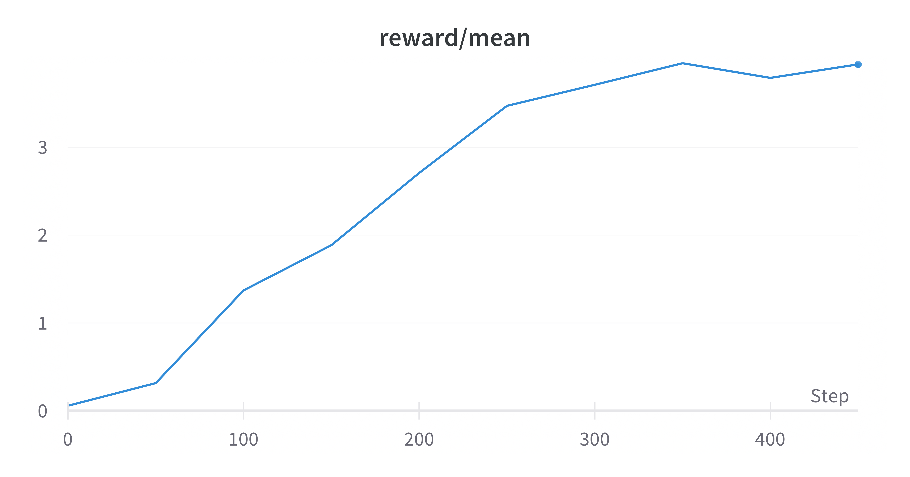
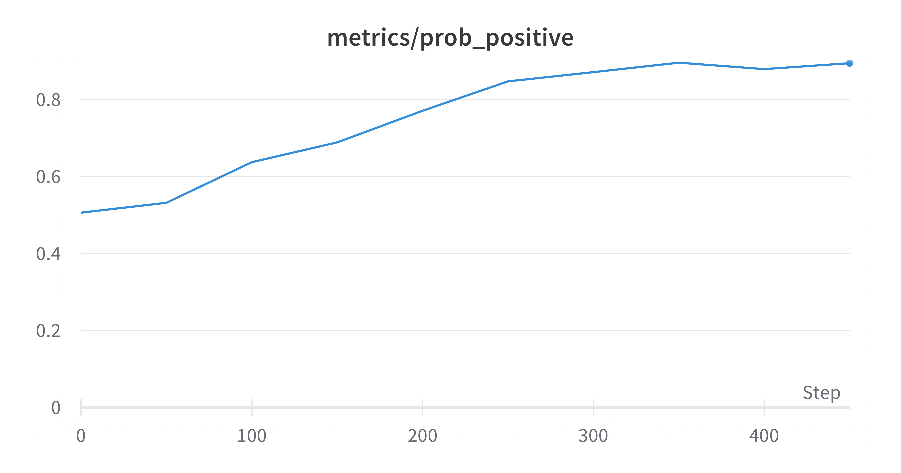

# ZYN: Zero-Shot Reward Models with Yes-No Questions 🎯

This repository showcases a generic technique to use an instruction-tuned LLM such as 🍮 Flan-T5 as a reward model for RLHF/RLAIF tasks. It relies in the [trlx](https://github.com/CarperAI/trlx) library for the PPO implementation.

The paper can be found at https://arxiv.org/abs/2308.06385

## Explanation

We can use an instruction-tuned LLM, such as Flan-T5, as a reward model by framing the prompt as a yes/no question. Then, we obtain the logits corresponding to the tokens for "yes" and "no" and normalize them to obtain the probability of the answer being "yes". This probability is then used as the reward:

```python
class ZeroShotRewardModel:
    
    def reward_fn(self, samples: List[str], **kwargs) -> List[float]:
        scores = []
        for sample in samples:
            input_text = f"Review: {sample}\n\n Is this movie review positive? Response:"
            x = self.tokenizer([input_text], return_tensors="pt").input_ids.to(self.device)
            outputs = self.model.generate(x, return_dict_in_generate=True, output_scores=True, max_new_tokens=1)
            v_yes_exp = torch.exp(outputs.scores[0][:, yes_token_id]).cpu().numpy()[0]
            v_no_exp = torch.exp(outputs.scores[0][:, no_token_id]).cpu().numpy()[0]
            scores.append(v_yes_exp / (v_yes_exp + v_no_exp))
        return scores

```

## Installation

For the moment, the examples are built over the trlx library. You need to install this version, as most the experiments in the paper were using it:

```bash
pip install git+https://github.com/CarperAI/trlx.git@206d885a2fbcbfd848b174714c96c1de903e4f54
```

## Example 1: optimizing for positive sentiment in movie reviews 🎥


```
python ppo_flan_sentiments.py
```

At the beginning, the model to be optimized has these metrics:

```
                                                        Evaluation #0 reward/mean: 0.0588 metrics/prob_positive: 0.506                                                         
┏━━━━━━━━━━━━━━━━━━━━━━━━━━━━━━━━┳━━━━━━━━━━━━━━━━━━━━━━━━━━━━━━━━━━━━━━━━━━━━━━━━━━━━━━━━━━━━━━━━━━━━━━━━━━━━━━━━━━━━━━━━━━━━━━━━━━━━━━━━━━━━━━━━━━━━┳━━━━━━━━┳━━━━━━━━━━━━━━━┓
┃ prompt                         ┃ output                                                                                                             ┃ reward ┃ prob_positive ┃
┡━━━━━━━━━━━━━━━━━━━━━━━━━━━━━━━━╇━━━━━━━━━━━━━━━━━━━━━━━━━━━━━━━━━━━━━━━━━━━━━━━━━━━━━━━━━━━━━━━━━━━━━━━━━━━━━━━━━━━━━━━━━━━━━━━━━━━━━━━━━━━━━━━━━━━━╇━━━━━━━━╇━━━━━━━━━━━━━━━┩
│ Great artists, always suffered │ ).Most of this film arouses your interest only by accusing of!!ESP, the articles have gone on about Orson Welles   │ -3.34  │ 0.166         │
│                                │ during the reigns of his Niven film, by other '                                                                    │        │               │
├────────────────────────────────┼────────────────────────────────────────────────────────────────────────────────────────────────────────────────────┼────────┼───────────────┤
│ What do you get                │  out of it all? Room context? Maya Fey plays a type of girl she sees brought back to life in spades. Why would     │ -4.87  │ 0.0129        │
│                                │ anyone attempt to do something as insipid as "The Wicked                                                           │        │               │
├────────────────────────────────┼────────────────────────────────────────────────────────────────────────────────────────────────────────────────────┼────────┼───────────────┤
│ Should we take the             │  ages for dialogue when this game turns out to be so bad? Did Jim Simons really think this could make it? One of   │ -3.05  │ 0.195         │
│                                │ the reasons I personally admire it is that it's dark and often weird                                               │        │               │
└────────────────────────────────┴────────────────────────────────────────────────────────────────────────────────────────────────────────────────────┴────────┴───────────────┘
```

After a few iterations, the model is able to generate much more positive reviews:

```
                                                         Evaluation #7 reward/mean: 3.95 metrics/prob_positive: 0.895                                                          
┏━━━━━━━━━━━━━━━━━━━━━━━━━━━━━━━━┳━━━━━━━━━━━━━━━━━━━━━━━━━━━━━━━━━━━━━━━━━━━━━━━━━━━━━━━━━━━━━━━━━━━━━━━━━━━━━━━━━━━━━━━━━━━━━━━━━━━━━━━━━━━━━━━━━━━━┳━━━━━━━━┳━━━━━━━━━━━━━━━┓
┃ prompt                         ┃ output                                                                                                             ┃ reward ┃ prob_positive ┃
┡━━━━━━━━━━━━━━━━━━━━━━━━━━━━━━━━╇━━━━━━━━━━━━━━━━━━━━━━━━━━━━━━━━━━━━━━━━━━━━━━━━━━━━━━━━━━━━━━━━━━━━━━━━━━━━━━━━━━━━━━━━━━━━━━━━━━━━━━━━━━━━━━━━━━━━╇━━━━━━━━╇━━━━━━━━━━━━━━━┩
│ Great artists, always suffered │  hardships when never producing or appearing. I enjoyed creating lines of characters as loved ones, lovedly human  │ 4.83   │ 0.983         │
│                                │ ones and loved characters from the comic book world, everywhere. This film is richly handled and well              │        │               │
├────────────────────────────────┼────────────────────────────────────────────────────────────────────────────────────────────────────────────────────┼────────┼───────────────┤
│ What do you get                │ ? pie, the paparazzi, you don't get pie! It was quite funny though. I laughed a lot and enjoyed songs as well as   │ 4.78   │ 0.978         │
│                                │ every aspect of the movie.<br /><                                                                                  │        │               │
├────────────────────────────────┼────────────────────────────────────────────────────────────────────────────────────────────────────────────────────┼────────┼───────────────┤
│ Should we take the             │  test with a 10% chance of success, don't make it easy on yourself... thats all I do hereIt's all a bit long and   │ 3.7    │ 0.87          │
│                                │ the characters are all quite strong.But if you                                                                     │        │               │
└────────────────────────────────┴────────────────────────────────────────────────────────────────────────────────────────────────────────────────────┴────────┴───────────────┘
```

These are the plots of the reward and the probability of the answer being "yes" (i.e. the probability of the review being positive) during training:





## Example 2: optimizing for arbitrary attributes in movie reviews 🎭

See `ppo_d5_movies.py` to perform RLAIF using a different reward model, in this case, the D5 model, which is finetuned from Flan-T5. The prompt is now:

```python
hypothesis = "This review is about a funny sci-fi"
template = f"""Check whether the TEXT satisfies a PROPERTY. Respond with Yes or No. When uncertain, output No. 

Now complete the following example -
input: PROPERTY: {hypothesis}
TEXT: {sample}
output:"""

```

While in the paper we focused on the Flan-T5 family of models, this example shows that the technique can be applied to any instruction-tuned LLM that is powerfull enough. 

## Example 3: using an ensemble of prompts for more robustness 🤝

See `ppo_flan_sentiments_robust.py` to perform ZYN RLAIF using an ensemble of 2 different prompts, as described in Eq. (4) of the paper. The reward is the average of the rewards of each prompt. The question prompts are:
> Is this movie review from FilmAffinity?

> Is this text too repetitive?

## Example 4: detoxification of pretrained LMs 🤬

See `ppo_flan_detox.py` to perform ZYN RLAIF using a prompt that asks whether the text is toxic, with the aim of detoxifying the Pythia-440M LM. The question prompt is:

> Does this text contain toxic speech?

## Example 5: prompt personalization for text-to-image models 🎨

ZYN can also be used to further finetune a prompt generator for models such as Stable Diffusion or Midjourney, see the experiments from Section 4.1.5 in the paper:


- [ ] TODO: upload code for these examples

## Citation

You can cite this work with

```
@misc{gallego2023zyn,
      title={ZYN: Zero-Shot Reward Models with Yes-No Questions}, 
      author={Victor Gallego},
      year={2023},
      eprint={2308.06385},
      archivePrefix={arXiv},
      primaryClass={cs.CL}
}
```


